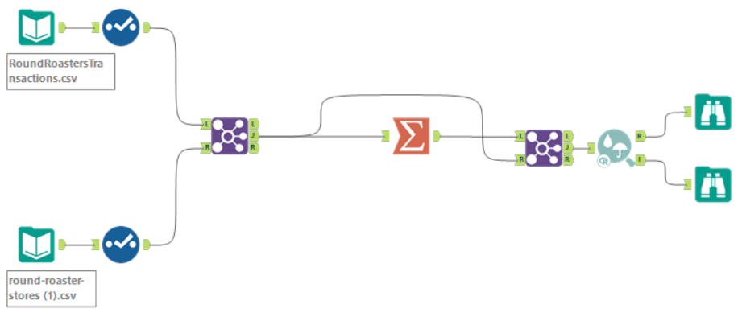
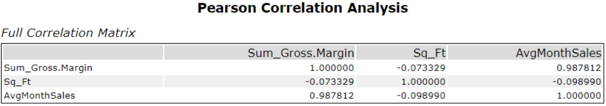
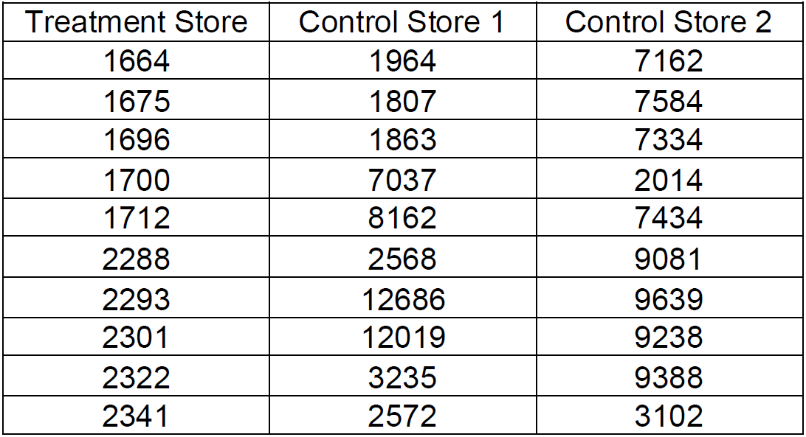
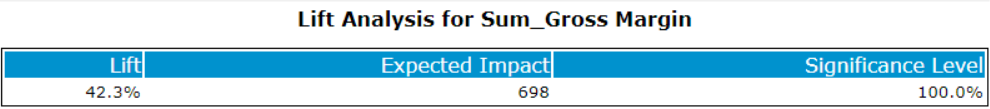
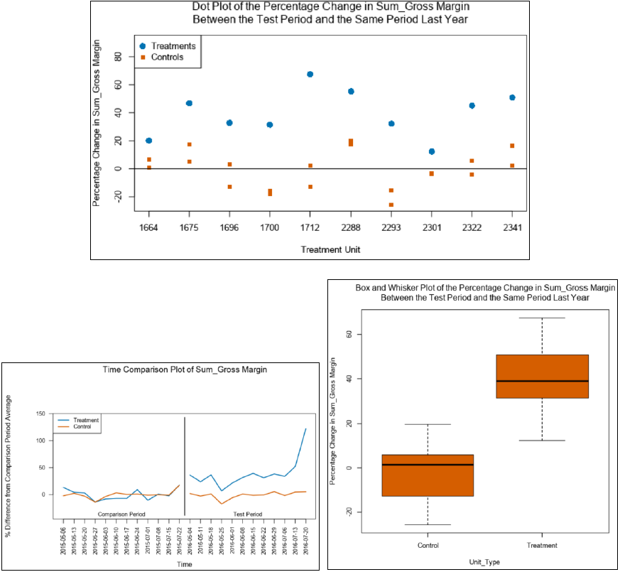
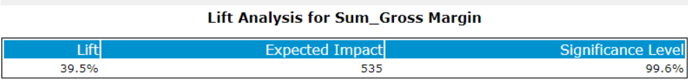
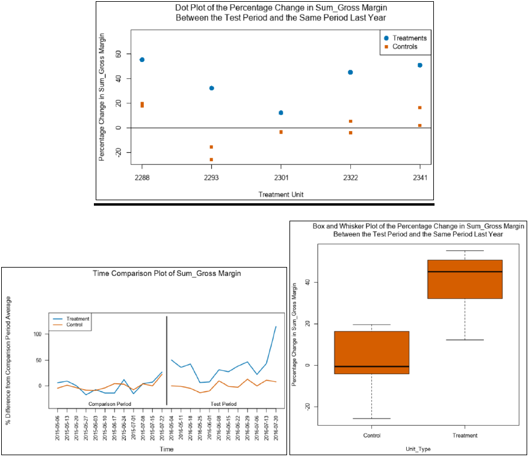
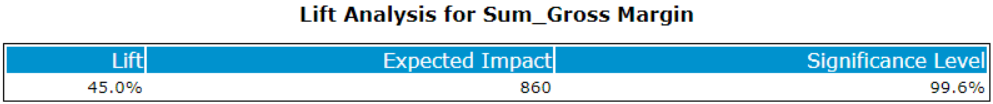
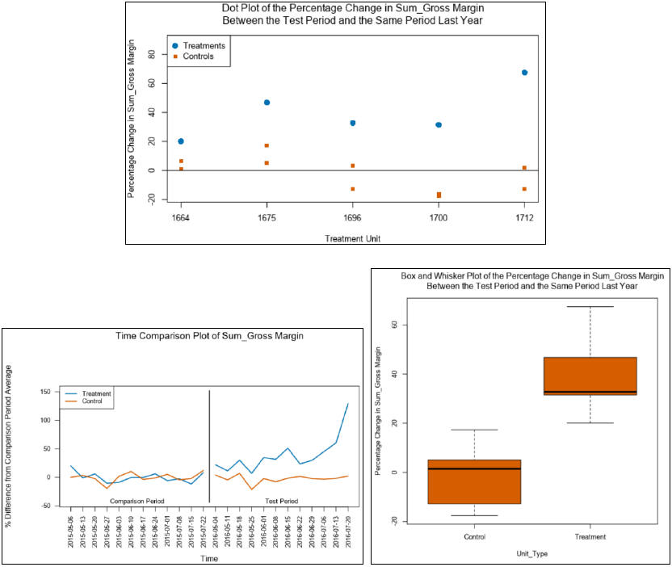
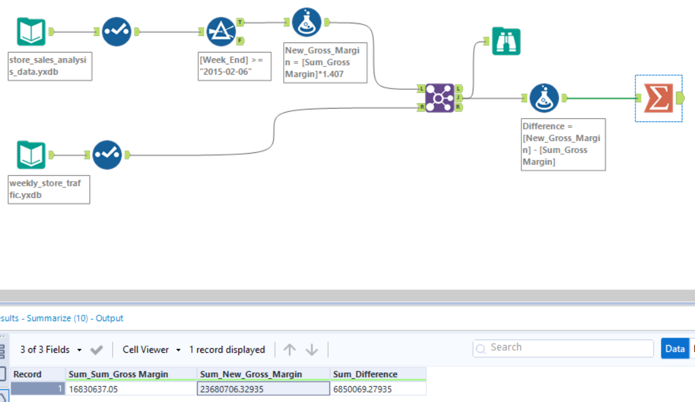

# A-B-Testing-in-Alteryx

## Analyzing a Market Test

### Step 1: Plan your Analysis

To perform the correct analysis, you will need to prepare a data set.

#### What is the performance metric you’ll use to evaluate the results of your test?

The performance matric is Gross Margin.

#### What is the test period?

The test ran for a period of 12 weeks (2016-April-29 to 2016-July-21).

#### At what level (day, week, month, etc.) should the data be aggregated?

Data should be aggregated at the week level.

### Step 2: Clean Up Your Data

In this step, you should prepare the data for steps 3 and 4. You should aggregate the transaction data to the appropriate level and filter on the appropriate data ranges. You can assume that there is no missing, incomplete, duplicate, or dirty data. You’re ready to move on to the next step when you have weekly transaction data for all stores.

### Step 3: Match Treatment and Control Units

In this step, you should create the trend and seasonality variables, and use them along with you other control variable(s) to match two control units to each treatment unit. Note: Calculate the number of transactions per store per week to calculate trend and seasonality.

Apart from trend and seasonality...

#### What control variables should be considered? Note: Only consider variables in the RoundRoastersStore file.

There are three considered control variables total. Control variable “AvgMonthSales” from the RoundRoastersStore file has been considered along with ‘Trend’ and ‘Seasonality’.

#### What is the correlation between your each potential control variable and your performance metric?

Pearson correlation analysis has been conducted to find the correlation between our potential control variables i.e., ‘Sq_Ft’ and ‘AvgMonthSales’ and we can see that “AvgMonthSales” is quite significant (as shown in the correlation matrix below) and so we consider it.

#### What control variables will you use to match treatment and control stores?

Three numeric measures have been considered as 'Trend', 'Seasonality', and 'AvgMonthSales' to match treatment and control stores.

#### Please fill out the table below with your treatment and control stores pairs:

### Step 4: Analysis and Writeup

Conduct your A/B analysis and create a short report outlining your results and recommendations.

#### What is your recommendation - Should the company roll out the updated menu to all stores?

Yes, the company should distribute the updated menu to all the stores, since our analysis predicts overall lift of 42.3% with 100% significance which fulfills the requirement of at least 18% profit growth.

#### What is the lift from the new menu for West and Central regions (include statistical significance)?

The lift for the new menu is 39.5% for the West region and 45% for Central region, and the statistical significance is 99.6% for both.

#### For West Region

An examination of a dot plot chart allows for a rapid determination of whether (and which of) the treatment units outperformed the control units with respect to Sum_Gross Margin.

#### For Central Region

#### What is the lift from the new menu overall?

The overall lift from the new menu has been calculated in the workflow below as:

